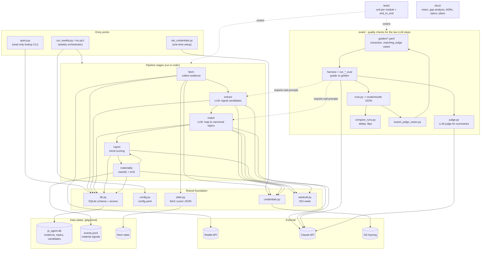

# Repository structure

Logical view of the repo, grouped by layer. Module dependencies reflect the actual imports.

## Notes

- The five pipeline stages share only SQLite. They don't call each other, except that `materiality` reuses `report`'s trend logic.
- Only `extract` and `match` call Claude (ADR 001). Trend and materiality scoring are deterministic (ADR 003).
- Evals import the production `extract` and `match` code, so they test the real prompts. `export_judge_cases` feeds saved runs back into the golden judge cases.
- The pipeline's only external output is `data/events.jsonl`, written by `materiality` (ADR 004).
